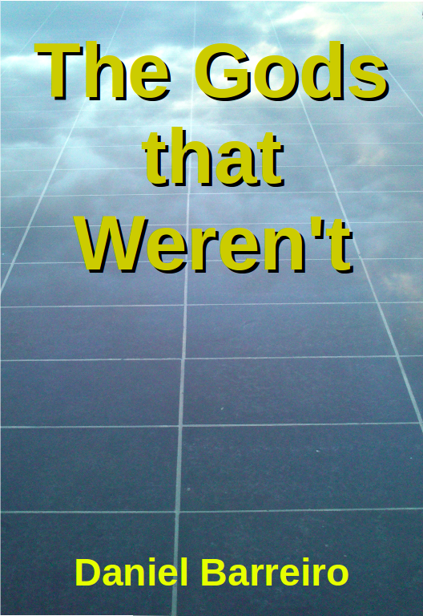

# The Gods that Weren't

## Contents

[01 - Allucio and the Observatory](01+-+Allucio+and+the+Observatory.md)
[02 - Becoming Keeper, meeting the trustee](02 - Becoming Keeper, meeting the trustee.md)
[03 - The signals from Heaven](03 - The signals from Heaven.md)
[04 - Going upriver](04 - Going upriver.md)
[05 - Ponju, first meeting with strangers](05 - Ponju, first meeting with strangers.md)
[06 - Second meeting with strangers](06 - Second meeting with strangers.md)
[07 - Trip to the Island](07 - Trip to the Island.md)
[08 - Rocket Launch](08 - Rocket Launch.md)
[09 - Anisia is free](09 - Anisia is free.md)
[10 - Anisia gets the job](10 - Anisia gets the job.md)
[11 - Allucio searches for the blueprints](11 - Allucio searches for the blueprints.md)
[12 - Bengo finds the blueprints](12 - Bengo finds the blueprints.md)
[13 - Getting ready to move](13 - Getting ready to move.md)
[14 - Digging](14 - Digging.md)
[15 - Found the structure](15 - Found the structure.md)
[16 - The new Supreme Priest](16 - The new Supreme Priest.md)
[17 - Making the Structure public](17 - Making the Structure public.md)
[18 - A visitor from outer space](18 - A visitor from outer space.md)
[19 - Fania's trip](19 - Fania's trip.md)
[20 - Laying the Cable](20 - Laying the Cable.md)
[21 - Banglion](21 - Banglion.md)
[22 - Licensing Wireless](22 - Licensing Wireless.md)
[23 - The second cable](23 - The second cable.md)
[24 - The Oath of Office](24 - The Oath of Office.md)
[25 - The Midway Station](25 - The Midway Station.md)
[26 - Heaven's Growth](26 - Heaven's Growth.md)
[Epilogue](Epilogue.md)
[Afterword](Afterword.md)
