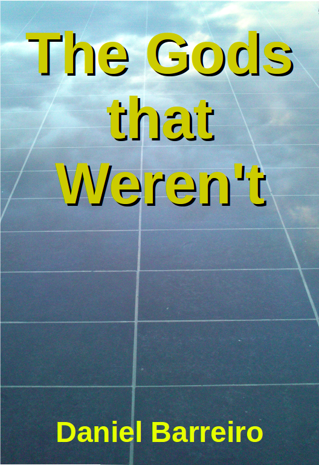

# The Gods that Weren't

## Contents

[01 - Allucio and the Observatory](01_Allucio_and_the_Observatory.md)

[02 - Becoming Keeper, meeting the trustee](02_Becoming_Keeper__meeting_the_trustee.md)

[03 - The signals from Heaven](03_The_signals_from_Heaven.md)

[04 - Going upriver](04_Going_upriver.md)

[05 - Ponju, first meeting with strangers](05_Ponju__first_meeting_with_strangers.md)

[06 - Second meeting with strangers](06_Second_meeting_with_strangers.md)

[07 - Trip to the Island](07_Trip_to_the_Island.md)

[08 - Rocket Launch](08_Rocket_Launch.md)

[09 - Anisia is free](09_Anisia_is_free.md)

[10 - Anisia gets the job](10_Anisia_gets_the_job.md)

[11 - Allucio searches for the blueprints](11_Allucio_searches_for_the_blueprints.md)

[12 - Bengo finds the blueprints](12_Bengo_finds_the_blueprints.md)

[13 - Getting ready to move](13_Getting_ready_to_move.md)

[14 - Digging](14_Digging.md)

[15 - Found the Structure](15_Found_the_Structure.md)

[16 - The new Supreme Priest](16_The_new_Supreme_Priest.md)

[17 - Making the Structure public](17_Making_the_Structure_public.md)

[18 - A visitor from outer space](18_A_visitor_from_outer_space.md)

[19 - Fania's trip](19_Fania_s_trip.md)

[20 - Laying the Cable](20_Laying_the_Cable.md)

[21 - Banglion](21_Banglion.md)

[22 - Licensing Wireless](22_Licensing_Wireless.md)

[23 - The second cable](23_The_second_cable.md)

[24 - The Oath of Office](24_The_Oath_of_Office.md)

[25 - The Midway Station](25_The_Midway_Station.md)

[26 - Heaven's Growth](26_Heaven_s_Growth.md)

[Epilogue](Epilogue.md)

[Afterword](Afterword.md)
